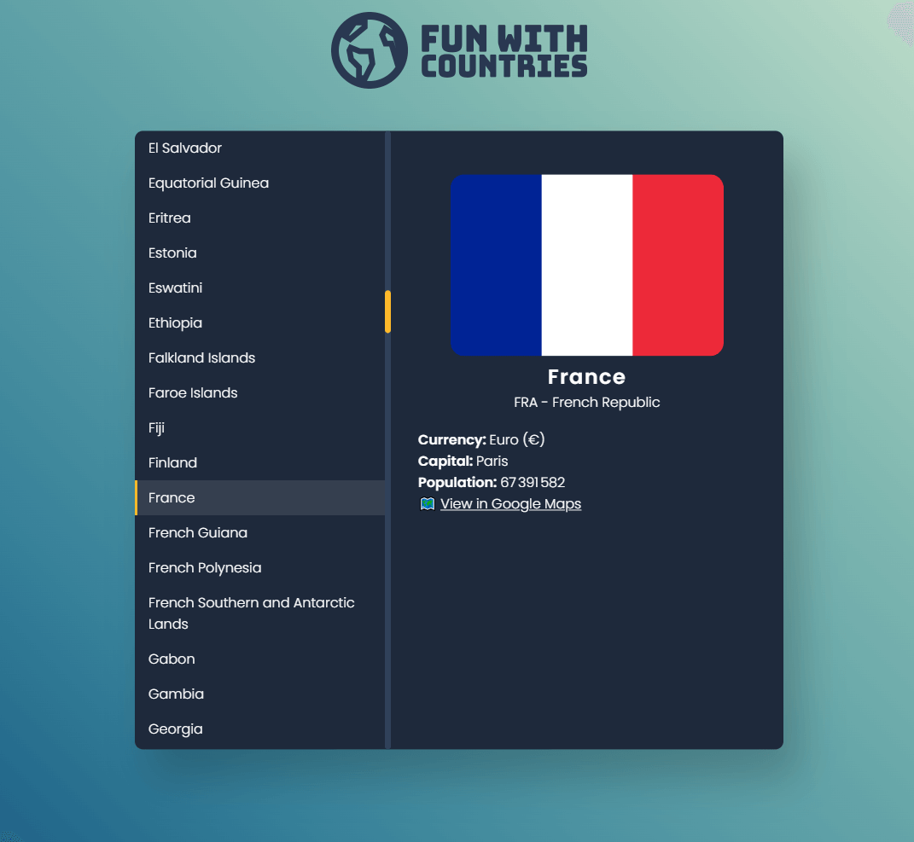

# Fun with countries

Fun with countries is a simple HTML/JS app for playing around with country data.

The app uses the [restcountries.com](restcountries.com) API to get the countries and their information.

Demo: [funwithcountries.shevarezo.fr](funwithcountries.shevarezo.fr)

* Blog: [blog.shevarezo.fr](blog.shevarezo.fr)
* Twitter : [twitter.com/shevabam](twitter.com/shevabam)

